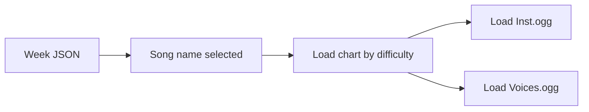

# How Songs and Weeks Connect

::: callout warning "Unfinished (WIP)"
This page is still being worked on and may change.
:::

## Simple idea

A week file lists songs. The engine then loads chart + audio files for each selected song.

## What must match

- Week song entry name
- Song folder name under `songs/`
- Chart file name for chosen difficulty

## Why this fails often

If one name/path is different, the week can appear but song load fails.

## Practical rule

When debugging, compare all three side-by-side:

1. Week song entry
2. `songs/<song>/` folder
3. `songs/<song>/charts/<difficulty>.json`