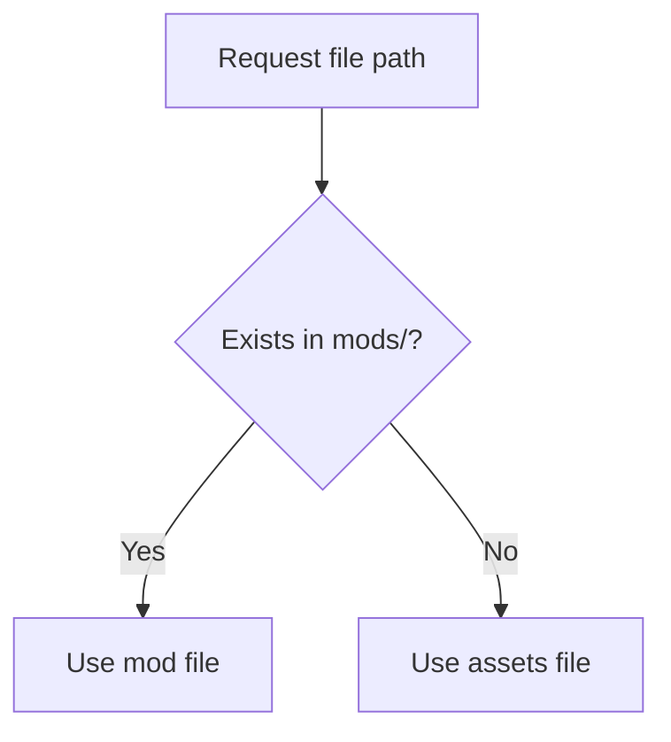

# How Asset Overrides Work

::: callout warning "Unfinished (WIP)"
This page is still being worked on and may change.
:::

The engine mounts mod root before base assets.

This applies to JSON, images, and audio lookups handled through `Paths` + asset library roots.
