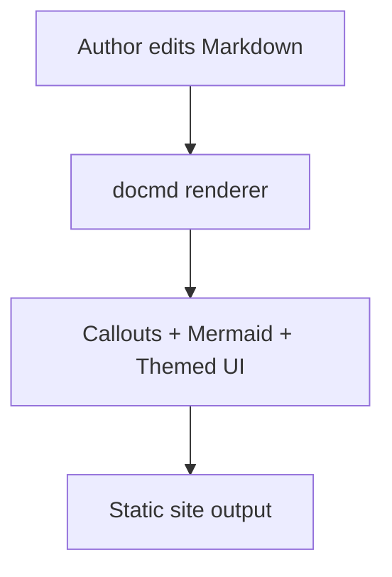

# Plugin Showcase

This page verifies the migrated docmd feature set in one place.

## Callouts

::: callout tip "Callout rendering"
If this block is styled as a callout card, docmd callouts are working.
:::

::: callout warning "CI note"
This docs site now builds with `docmd build` in GitHub Actions.
:::

## Mermaid

## Heading navigation

### Section One

Quick content for local TOC verification.

### Section Two

More content for TOC scrolling behavior.

#### Subsection Two-A

Nested heading so the page TOC has hierarchy.

### Section Three

Final section to confirm links and highlighting.
