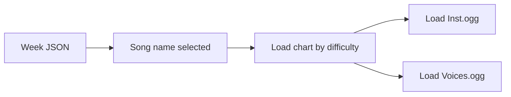

# Cómo se conectan las canciones y las semanas

::: callout warning "Sin terminar (WIP)"
Todavía se está trabajando en esta página y puede cambiar.
:::

## Idea sencilla

Un archivo semanal enumera canciones. Luego, el motor carga archivos de gráficos y audio para cada canción seleccionada.

## ¿Qué debe coincidir?

- Nombre de la entrada de la canción de la semana.
- Nombre de la carpeta de canciones en `songs/`
- Nombre del archivo del gráfico para la dificultad elegida.

## Por qué esto falla con frecuencia

Si un nombre/ruta es diferente, la semana puede aparecer pero la carga de la canción falla.

## Regla práctica

Al depurar, compare los tres uno al lado del otro:

1. Entrada de canción de la semana
2. Carpeta `songs/<song>/`
3. `songs/<song>/charts/<difficulty>.json`