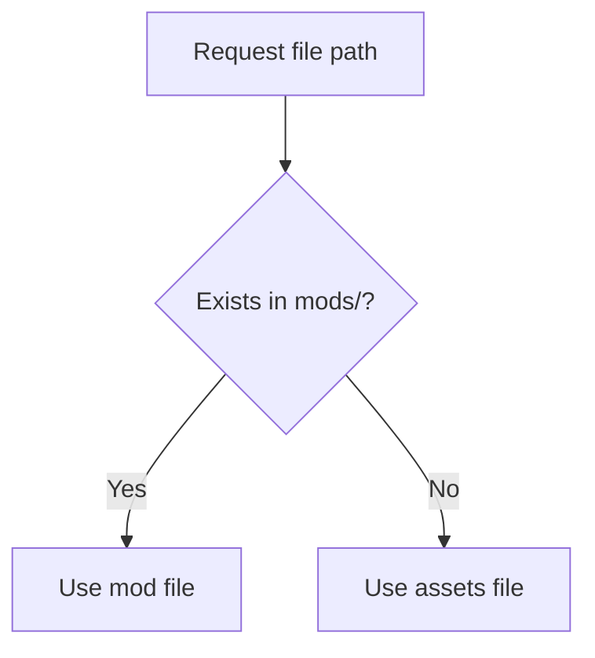

# Como Funcionan los Overrides de Assets

::: callout warning "Sin terminar (WIP)"
Esta pagina todavia se esta trabajando y puede cambiar.
:::

El engine monta la raiz del mod antes que los assets base.

Esto aplica a las busquedas de JSON, imagenes y audio manejadas mediante `Paths` + raices de libreria de assets.