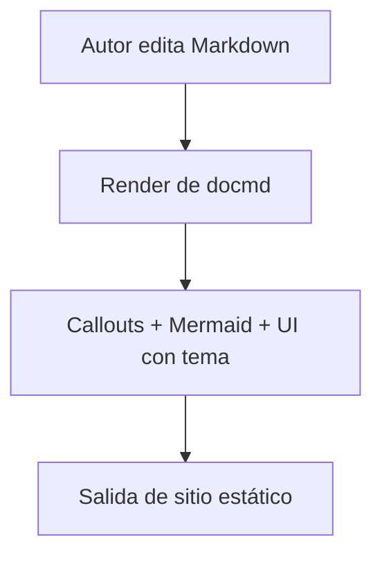

# Vitrina de Plugins

Esta página verifica en un solo lugar el conjunto de funciones migradas de docmd.

## Callouts

::: callout tip "Renderizado de callouts"
Si este bloque se ve como una tarjeta de aviso, los callouts de docmd están funcionando.
:::

::: callout warning "Nota de CI"
Este sitio de documentación ahora se construye con `docmd build` en GitHub Actions.
:::

## Mermaid

## Navegación por encabezados

### Sección Uno

Contenido breve para validar el TOC local.

### Sección Dos

Más contenido para validar el comportamiento de desplazamiento del TOC.

#### Subsección Dos-A

Encabezado anidado para verificar jerarquía en el TOC de la página.

### Sección Tres

Sección final para confirmar enlaces y resaltado.
