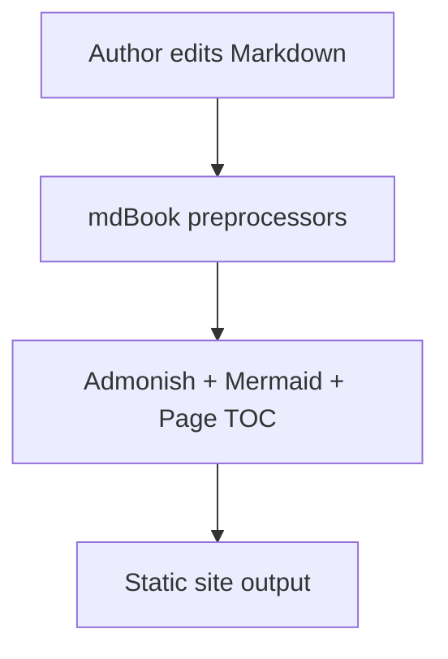

# Plugin Showcase

This page verifies all configured mdBook plugins in one place.

## Admonish

```admonish tip title="Admonish is active"
If this block is styled as a callout card, `mdbook-admonish` is working.
```

```admonish warning title="CI note"
Remember to run `mdbook-admonish install book` after plugin upgrades.
```

## Mermaid



## Page TOC headings

### Section One

Quick content for local TOC verification.

### Section Two

More content for TOC scrolling behavior.

#### Subsection Two-A

Nested heading so the page TOC has hierarchy.

### Section Three

Final section to confirm links and highlighting.
